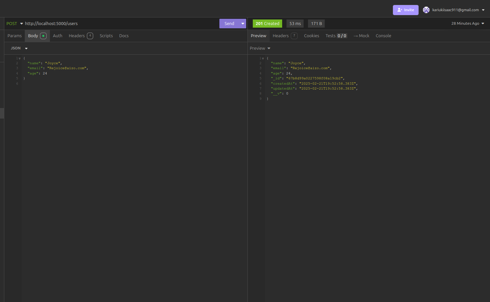
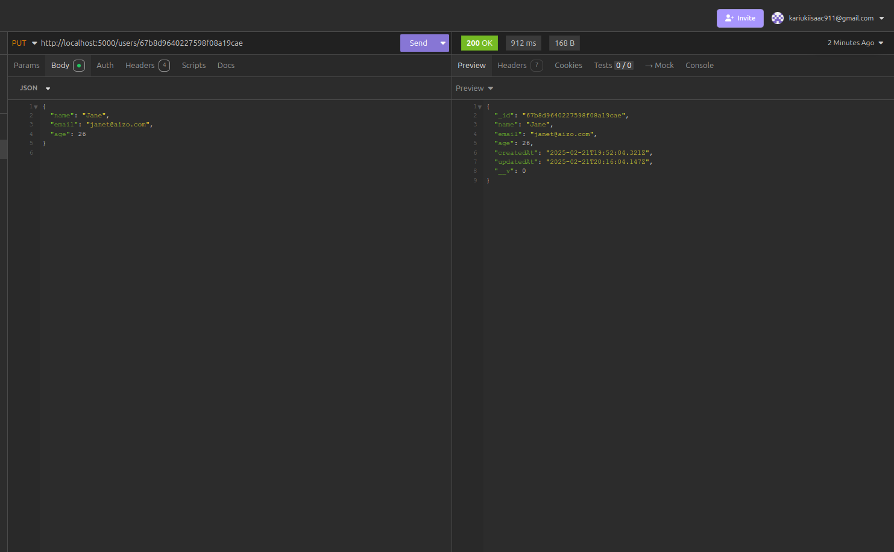
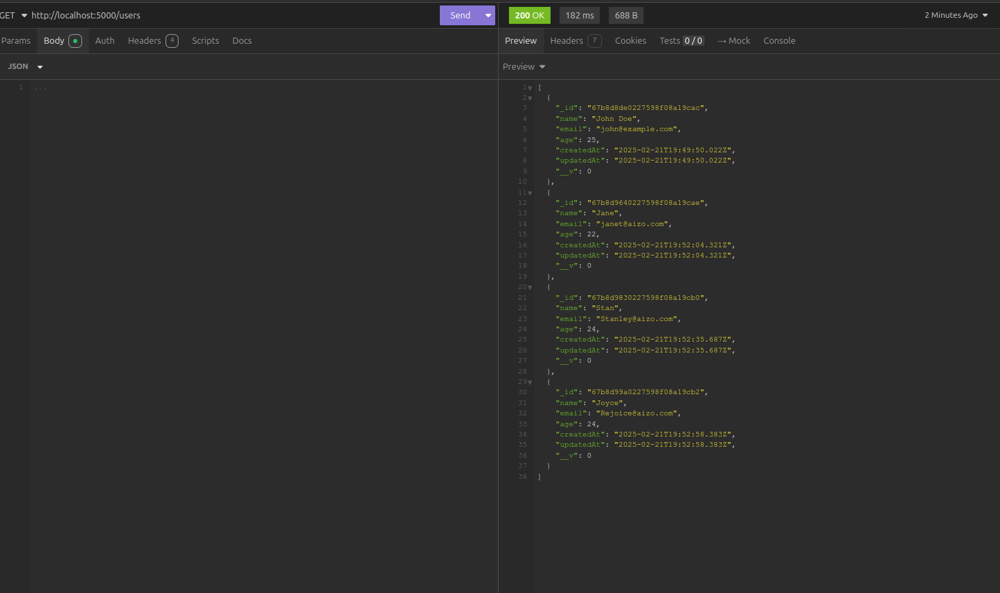
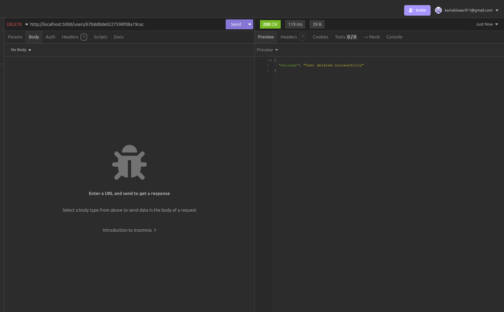
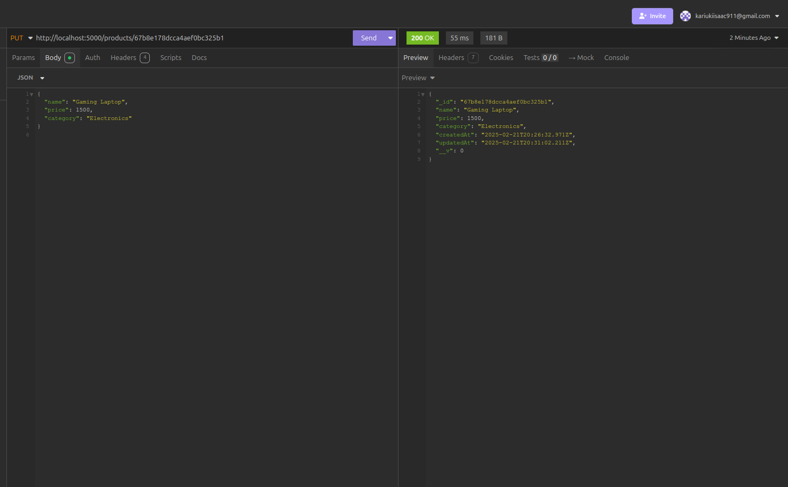
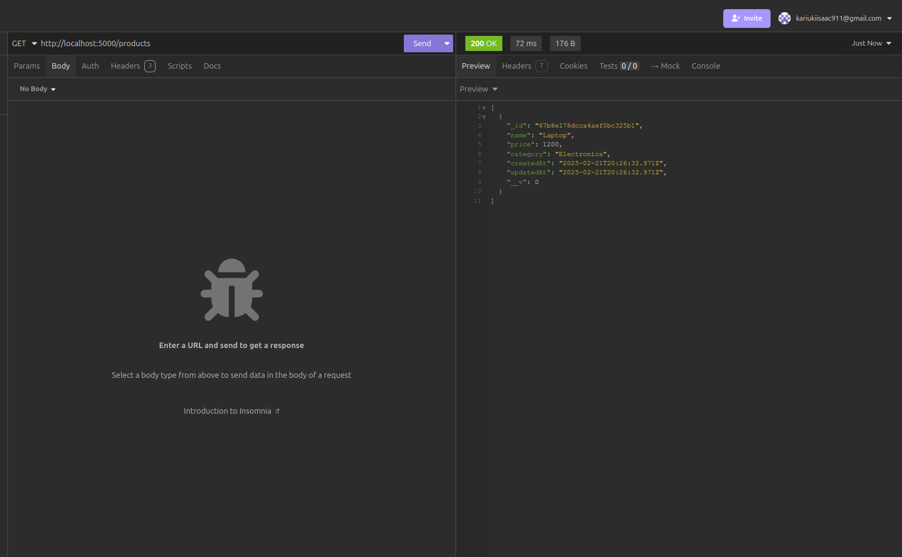
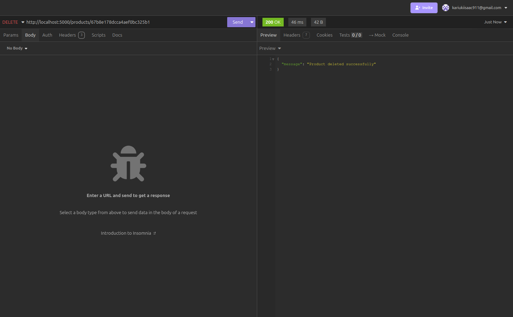

# Express Assignment API 🚀

This is a **Node.js + Express API** with MongoDB for managing **Users** and **Products**. It supports CRUD operations and uses **Mongoose** for database management.

## 📌 Features
- ✅ User and Product Management
- ✅ Create, Read, Update, Delete (CRUD) operations
- ✅ Middleware for Logging and Error Handling
- ✅ Environment Variables with `.env`
- ✅ MongoDB Connection using Mongoose

---


## Usage/Examples


## 🚀 Getting Started

### 1️⃣ **Clone the Repository**

```bash
git clone https://github.com/PLP-Full-Stack-Development-MERN/week-2-express-js-fundamentals-assignment-aizocraft.git
cd express-assignment
```

### 2️⃣ Install Dependencies

```bash
npm install
```

3️⃣ Set Up Environment Variables

Create a .env file in the root directory and add:

```bash
PORT=5000
MONGO_URI=mongodb://localhost:27017/expressDB
```

4️⃣ Run the Server


```bash
npm run dev
```
or

```bash
npm start
```


---

## API Endpoints

### 👤 User Routes
| Method | Endpoint         | Description            |
| :---:  | :---:            | :---                   |
| POST   | `/users`        | Create a new user      |
| GET    | `/users`        | Get all users          |
| GET    | `/users/:id`    | Get a user by ID       |
| PUT    | `/users/:id`    | Update a user          |
| DELETE | `/users/:id`    | Delete a user          |

#### Example Requests

1️⃣ **Create a User (POST)**
- **Method**: POST
- **URL**: `http://localhost:5000/users`
- **Body (JSON)**:
    ```json
    {
      "name": "Joyce",
      "email": "Rejoice@aizo.com",
      "age": 24
    }
    ```
- **Screenshot**:
    

2️⃣ **Update a User (PUT)**
- **Method**: PUT
- **URL**: `http://localhost:5000/users/<user_id>`
- **Body (JSON)**:
    ```json
    {
      "name": "Jane",
      "email": "janet@aizo.com",
      "age": 26
    }
    ```
- **Screenshot**:
    

3️⃣ **Get All Users (GET)**
- **Method**: GET
- **URL**: `http://localhost:5000/users`
- **Screenshot**:
    

4️⃣ **Delete a User (DELETE)**
- **Method**: DELETE
- **URL**: `http://localhost:5000/users/<user_id>`
- **Screenshot**:
    

---

### 🛒 Product Routes
| Method | Endpoint         | Description            |
| :---:  | :---:            | :---                   |
| POST   | `/products`     | Create a new product    |
| GET    | `/products`     | Get all products        |
| GET    | `/products/:id` | Get a product by ID     |
| PUT    | `/products/:id` | Update a product        |
| DELETE | `/products/:id` | Delete a product        |

#### Example Requests

1️⃣ **Create a Product (POST)**
- **Method**: POST
- **URL**: `http://localhost:5000/products`
- **Body (JSON)**:
    ```json
    {
      "name": "Laptop",
      "price": 1200,
      "category": "Electronics"
    }
    ```
- **Screenshot**:
    

2️⃣ **Update a Product (PUT)**
- **Method**: PUT
- **URL**: `http://localhost:5000/products/<product_id>`
- **Body (JSON)**:
    ```json
    {
      "name": "Gaming Laptop",
      "price": 1500,
      "category": "Electronics"
    }
    ```
- **Screenshot**:
    

3️⃣ **Get All Products (GET)**
- **Method**: GET
- **URL**: `http://localhost:5000/products`
- **Screenshot**:
    

4️⃣  **Delete a Product (DELETE)**
- **Method**: DELETE
- **URL**: `http://localhost:5000/products/<product_id>`
- **Screenshot**:
    

## Project Structure

  ```
   /express-assignment
 ├── /models
 │   ├── User.js
 │   ├── Product.js
 │
 ├── /routes
 │   ├── userRoutes.js
 │   ├── productRoutes.js
 │
 ├── /middleware
 │   ├── logger.js
 │
 ├── .env
 ├── index.js
 ├── package.json
 ├── README.md
   ```

## License

[MIT](https://choosealicense.com/licenses/mit/)
